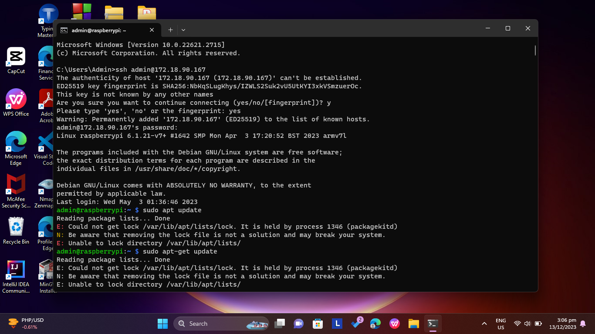

# Information Assurance and Security - Final Project

| ** Keylogger Group of BSCS 3B ** |
| -------------------------- |
| Abenir, John Louie |
| Ballerda, Carlo James |
| Dagon, Cecil |
| Celetaria, Rodney |

## STEP-BY-STEP DOCUMENTATION

### 1. Install Headless Raspbian OS into Raspberry Pi.
- Raspberry Pi Imager is the quick and easy way to install Raspberry Pi OS and other operating systems to a microSD card, ready to use with your Raspberry Pi.
- Download and install Raspberry Pi Imager to a computer with an SD card reader. Put the SD card you'll use with your Raspberry Pi into the reader and run Raspberry Pi Imager.
- Here is the link for the [Raspberry Pi Imager](https://www.raspberrypi.com/software/)

- Open Raspberry Pi Imager. Choose Raspberrry Pi Device, Operating System, and Storage.
- In this project, we choose **_Raspberry Pi 3_** as device, **_Raspberry Pi OS (Legacy)_** as operating system, and our **_32GB SD Card_** as storage.
- After choosing the preferred device, OS, and storage, click **Next**.
- and click **Edit Settings** to customize the OS Settings.
- In the OS Customization, we set the host as **raspberrypi**, username as **username**, and password as **password**. We configure our wireless LAN available which is **CSPC BayanihanNet** and set the wireless LAN   country to **PH.** Lastly, we set our timezone to **Asia/Shanghai** since they have the same timezone (GMT+8) with Manila, then click **Save**.
- Don't forget to enable SSH and use password authentication, then click **Save**.
- Click **Yes** to apply our customized settings.
> [!WARNING]
> Make sure to backup all existing data in the SD card to avoid deletion while formatting.
- A warning will appear that all existing data on our SD card will be erased if we continue on our installation. Click **Yes** since our SD card have no existing files that needs to be backed up.
- OS writing on our SD card will then start
- After writing, verification will start.
- Wait until the verification hits 100%, and write succesfull prompt will appear. In this part, it's now safe to eject our SD card from the PC.
> [!NOTE]
> Plug in the SD card first on Raspberry Pi before proceeding to the next step.

### 2. Connect to Raspberry Pi via SSH (Secure Socket Shell) then update the OS ###
In the command prompt, type SSH to access the network protocol. Then type the following command:
   - ssh username@hostname (e.g. username@172.18.90.149 or pogiako@raspberypi.local)
   - sudo apt update
   - sudo apt upgrade

### 3. Install LAMP Stack. LAMP stands for Linux, Apache, MySQL, and PHP. 
This stack is typically installed together in order to enable a server to host dynamic websites and web apps written in PHP.
Here are the tutorials on how to install LAMP stack 
[How to Install PHPMyAdmin on Raspberry Pi](https://ostechnix.com/install-apache-mysql-php-lamp-stack-on-ubuntu-18-04-lts/)
[Install Apache, MySQL, PHP (LAMP) Stack On Ubuntu 18.04 LTS](https://linuxhint.com/install-phpmyadmin-raspberry-pi/)
 - To install the stack, type the following commands on our command prompt connected to Raspberry Pia via SSH.
    + **_sudo apt install apache2_**
    + **_sudo apt install mariadb-server_**
    + **_sudo mysql_secure_installation_**
    + **_sudo apt install php libapache2-mod-php php-mysql_**
    + **_sudo apt-get install php_**
    + **_sudo apt install phpmyadmin_**

### 4. Connect to Raspberry Pi via VNC
- Install RealVNC® Viewer to the device you want to control from via this [link](https://www.realvnc.com/en/connect/download/viewer/)
- Before opening VNC on our PC, access first the Raspberry Pi Configuration Tool to enable VNC on the OS via the **_sudo raspi-config_** command.
- Using the arrows, navigate to **'Interfacing Options'** > **'VNC'**, then choose **'Yes'** and select **'OK'**
- On the device you will use to take control, run RealVNC Viewer and enter the private IP address in the search bar. If the screen of the Raspberry Pi appeared on RealVNC, it means that it already established connection and control on the Raspberry Pi.
